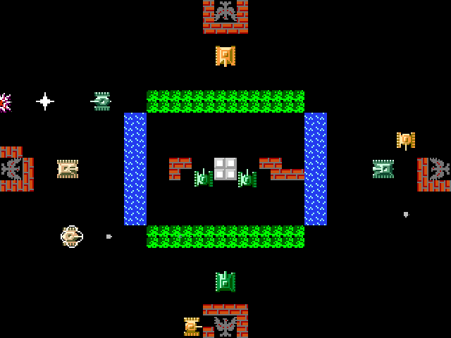

# Tanks PVP
Simple 2D game (Battle City like) for researching ECS in Unity with multiplayer.

This is my first work with ECS, so the use of this project as an example is not recommended.

### Game description

- `W` `A` `S` `D` - moving
- `SPACE` - fire
- Maximum 4 players
- Multiplayer game target: destroy bases of other players.
- Singleplayer game target: destroy enemy bots and protect you base.
- In multiplayer each player has 2 teammate bots (smaller tanks). You can enable/disable bots in lobby.

### Frameworks
- [Morpeh](https://github.com/X-Crew/Morpeh) for ECS
- [Photon](https://assetstore.unity.com/packages/tools/network/pun-2-free-119922) for Network

### Build And Run
For Photon work you need set your own `AppIdRealtime` in [PhotonServerSettings.asset](Assets/Photon/PhotonUnityNetworking/Resources/PhotonServerSettings.asset).

For more information go to [Photon manual](https://doc.photonengine.com/en-us/pun/v2/getting-started/initial-setup)

